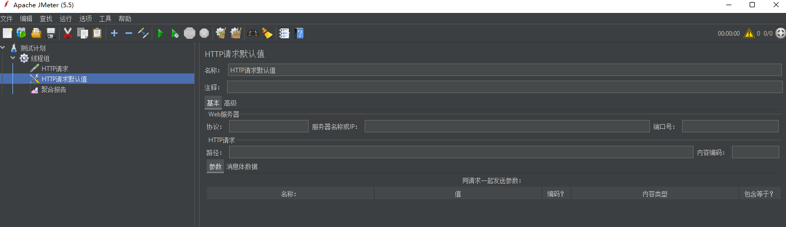

# seckill-demo

项目：主要目的是通过本项目练习SpingBoot学习过程中所学知识，逐渐将学习到的技能融合至项目中.

区域性抢占式核酸预约系统已完成/优化功能


1 项目框架搭建 	

1.1 SpringBoot环境搭建 	

1.2 集成Thymeleaf, RespBean 	

1.3 Mybatis-plus 

2 分布式会话 	

2.1 用户登录 			

a. 设计数据库 			

b. 明文密码二次MD5加密 			

c. 参数校验+全局异常处理 	

2.2 共享Session（主要为用户session） 			

a. SpringSession 			

b. Redis 

3 功能开发 	

3.1 核酸点位列表	

3.2立即预约

3.3 工单详情

4 系统压测 	

4.1 Jmeter 	

4.2 自定义变量模拟多用户 	

4.3 Jmeter命令行使用 	

4.4 正式压测 			

a. 检测点列表 			

b. 立即预约功能 

5 页面优化 	

5.1 页面缓存+URL缓存+对象缓存 	

5.2 页面静态化, 前后端分离 	

5.3 静态资源优化 	

5.4 CDN优化 6 接口优化 	

6.1 Redis预减库存减少数据库的访问 	

6.2 内存标记减少Redis的访问 	

6.3 RabbitMQ异步下单（异步预约） 			

a. SpringBoot整合RabbitMQ 			

b. 交换机EXCHANGE 7 安全优化 	

7.1 预约接口地址隐藏 	

7.2 算术验证码 	

7.3 接口防刷 

8 项目体验Demo.

# 1 项目框架搭建

## 1.1 SpringBoot环境搭建 

 正常搭建SpringBoot项目，勾选Web、Lombok、Thymeleaf、Spring Data JDBC等组件，后续随着项目进行会引入其他组件。

## 1.2 集成Thymeleaf, RespBean

Thymeleaf作为模板引擎，在创建项目时候已经引入，后续直接使用即可。

RespBean的目的是定义公共返回对象枚举，可以用作为用户在登录页面时的消息返回值类型。

## 1.3 Mybatis-plus 

本项目中使用Mybatis-plus逆向生成工具类生成mapper、service、serviceImpl、pojo、等文件。

详情逆向生成代码可见[Mybatis-plus代码生成器（旧）](https://baomidou.com/pages/d357af/)

# 2 分布式会话 

实现分布式会话的意义：将用户登录后生成的cookie保存下来，登录跳转后返回给goodsList页面，前面使用了model的方式传递用户cookie，后面引入了redis实现分布式session。

为什么要使用分布式session？

用户登录信息在tomcat1上保存，由于Nginx默认的负载均衡策略时轮询机制反向代码请求转发，在Tomcat上没有用户信息，通过分布式session将用户信息保存在缓存中间件redis中。这样，可以使用户信息在Tomcat上同步。

## 2.1 用户登录 

本部分主要涉及数据库设计、前端密码存储二次加密、登录参数校验、全局异常处理等工作。			

### a. 设计数据库

表设计：

**用户表**

|  id   | nickname | pwd  |    salt    | head | register_date | last_login_date | login_count |
| :---: | :------: | :--: | :--------: | ---- | :-----------: | :-------------: | :---------: |
| phone |   昵称   | MD5  | 盐（加密） | 头像 |   注册时间    |  最后登录时间   |  登录次数   |

```sql
create table `t_user` (
    `id` bigint(20) not null comment '用户ID,mobilephone',
    `nickname` varchar(255) not null,
    `password` varchar(32) not null comment 'MD5(MD5(pwd明文+固定salt)+salt)',
    `salt` varchar(10) default null,
    `head` varchar(128) default null,
    `register_date` datetime dafault null,
    `last_login_date` datetime dafault null,
    `login_count` int(11) default '0',
    primary key(`id`)
)engine=innodb default charset=utf8;
```

### b. 明文密码二次MD5加密 

参考MD5Utils.java具体实现.

因为http是明文传输的，也就是中间的路由可以看到我们用户提交的帐号密码信息，因此我们选择对用户的密码进行MD5加密。

使用两次MD5加密：

客户端：PASS=MD5（密码+固定Salt）在前端实现。防止用户密码直接在网络中传输。

服务端：PASS=MD5（用户输入+随机salt）在后端实现。防止数据库泄露用户密码。

### c. 参数校验

对用户登录时的手机号做验证

> 注:本部分需要引入validator依赖

> 1.新建@IsMobile注解

```java
/**
 * @description 自定义注解
 * @author Chenhf
 * @date 2022/7/1 16:40
 */
@Target({ METHOD, FIELD, ANNOTATION_TYPE, CONSTRUCTOR, PARAMETER, TYPE_USE })
@Retention(RUNTIME)
@Documented
@Constraint(validatedBy = {IsMobileValidator.class})
public @interface IsMobile {
    //加required
    boolean required() default true;

    String message() default "手机号码格式错误";

    Class<?>[] groups() default { };

    Class<? extends Payload>[] payload() default { };
}
```

> 2.定义注解校验逻辑实现

```java

/**
 * @description: 手机号码校验规则
 * @className: IsMobileValidator
 * @author: Chenhf
 * @date: 2022/7/1 16:43
 * @version: 1.0
 */
public class IsMobileValidator implements ConstraintValidator<IsMobile, String> {

    private boolean required = false;
    @Override
    public void initialize(IsMobile constraintAnnotation) {
        required = constraintAnnotation.required();
    }

    //自定义注解IsMobile的校验规则
    @Override
    public boolean isValid(String value, ConstraintValidatorContext context) {
        if (required){
            return ValidatorUtil.isMobile(value);
        }else {
            if (StringUtils.isEmpty(value)) {
                return true;
            }else {
                return ValidatorUtil.isMobile(value);
            }
        }
    }
}
```

> 3.ValidatorUtil里面使用正则表达式判断

```java
/**
 * @description: 校验工具类
 * @className: ValidatorUtil
 * @author: Chenhf
 * @date: 2022/6/30 19:36
 * @version: 1.0
 */
public class ValidatorUtil {
    //手机号位数校验
    private static final Pattern mobile_pattern = Pattern.compile("[1]([3-9])[0-9]{9}$");
    public static boolean isMobile(String mobile){
        //为空直接返回
        if (StringUtils.isEmpty(mobile)){
            return false;
        }
        //根据Pattern.compile的规则校验mobile，返回boolean类型
        Matcher matcher = mobile_pattern.matcher(mobile);
        return matcher.matches();
    }
}
```

> 4.在需要对参数校验的Controller中添加@Valid注解,登录的实体类LoginVo手机号属性添加我们自定义的@IsMobile注解

```java

@RequestMapping("/doLogin")
@ResponseBody
//加入validation校验功能
public RespBean doLogin(@Valid LoginVo loginVo, HttpServletRequest request, HttpServletResponse response){
    //用来测试用户输入
    //log.info("{}",loginVo);
    //Controller调用service
    return userService.doLogin(loginVo, request, response);
}
@Data
@SuppressWarnings("all")
public class LoginVo {
    //使用validation组件, 减少代码冗余
    @NotNull()
    //创建的自定义组件
    @IsMobile
    private String mobile;
    @NotNull
    @Length(min=32)
    private String password;
}
```

### d.全局异常处理 	

在前面RespBean定义了公共返回对象枚举，可以用作为用户在登录页面时的消息返回值类型。

这里定义全局异常处理,返回的就是一个responseBody

```java
@Data
@NoArgsConstructor
@AllArgsConstructor
public class GlobalException extends RuntimeException {
    private RespBeanEnum respBeanEnum;
}
```

```java
//返回的就是一个responseBody
@RestControllerAdvice
public class GlobalExceptionHandler {
    @ExceptionHandler(Exception.class)
    public RespBean ExceptionHandler(Exception e) {
        if (e instanceof GlobalException) {
            GlobalException ex = (GlobalException) e;
            return RespBean.error(ex.getRespBeanEnum());
        } else if (e instanceof BindException) {
            BindException ex = (BindException) e;
            RespBean respBean = RespBean.error(RespBeanEnum.BIND_ERROR);
            respBean.setMessage("参数校验异常：" + ex.getBindingResult().getAllErrors().get(0).getDefaultMessage());
            return respBean;
        }
        return RespBean.error(RespBeanEnum.ERROR);
    }
}
```

## 2.2 共享Session（主要为用户session） 

共享session需要同时满足a.b.两部分			

### a. SpringSession

引入SpringSession较简单,引入spring-session依赖即可

```xml
<!--Spring Session依赖-->
<dependency>
    <groupId>org.springframework.session</groupId>
    <artifactId>spring-session-data-redis</artifactId>
</dependency>
```

### b. Redis 

```xml
<!--springboot-data-redis依赖-->
<dependency>
    <groupId>org.springframework.boot</groupId>
    <artifactId>spring-boot-starter-data-redis</artifactId>
</dependency>
```

# 3 功能开发

 主要描述goodsList和goodsDetails后端实现

## 3.1 核酸预约列表

```java
@RequestMapping(value = "/toList", produces = "text/html;charset=utf-8")
@ResponseBody
public String toList(Model model, User user,HttpServletRequest request,HttpServletResponse response) {
    //通过redis valueOperations获取页面
    //redis中获取页面,如果不为空直接返回页面
    ValueOperations valueOperations = redisTemplate.opsForValue();
    String html = (String) valueOperations.get("goodsList");
    if (!StringUtils.isEmpty(html)){
        return html;
    }
    model.addAttribute("user",user);
    model.addAttribute("goodsList", goodsService.findGoodsVo());
    //return "goodsList";
    //如果页面为null,手动渲染存入redis返回
    WebContext context = new WebContext(request, response,request.getServletContext(), request.getLocale(),
            model.asMap());
    html = thymeleafViewResolver.getTemplateEngine().process("goodsList", context);
    if (!StringUtils.isEmpty(html)){
        valueOperations.set("goodsList",html,60, TimeUnit.SECONDS);
    }
    return html;
}
```

## 3.2 预约详情

```java
@RequestMapping("/detail/{goodsId}")
@ResponseBody
//相当于返回一个对象
public RespBean toDetail(Model model, User user, @PathVariable Long goodsId){

    GoodsVo goodsVo = goodsService.findGoodsVoByGoodsId(goodsId);
    //定义预约状态
    Date startDate = goodsVo.getStartDate();
    Date endDate = goodsVo.getEndDate();
    Date nowDate = new Date();
    int seckillStatus = 0;
    //预约倒计时
    int remainSeconds = 0;
    if (nowDate.before(startDate)){
        remainSeconds = ((int) ((startDate.getTime() - nowDate.getTime()) / 1000));
    } else if (nowDate.after(endDate)){
        seckillStatus = 2;
        remainSeconds = -1;
    } else {
        seckillStatus = 1;
        remainSeconds = 0;
    }
    //做了一个公共的返回对象,之前通过model传参,后面通过DetailVo传参
    DetailVo detailVo = new DetailVo();
    detailVo.setUser(user);
    detailVo.setGoodsVo(goodsVo);
    detailVo.setSeckillStatus(seckillStatus);
    detailVo.setRemainSeconds(remainSeconds);
    return RespBean.success(detailVo);
}
```

## 3.3 立即预约 	

```java
//跳转预约确定页面
@RequestMapping(value = "/{path}/doSeckill", method = RequestMethod.POST)
@ResponseBody
public RespBean doSecKill(@PathVariable String path, User user, Long goodsId){
    if (user==null){
        return RespBean.error(RespBeanEnum.SESSION_ERROR);
    }
    //1.实现after引入库存,通过redis操作
    ValueOperations valueOperations = redisTemplate.opsForValue();
    Boolean check = orderService.checkPath(user, path, goodsId);
    if(!check) {
        return RespBean.error(RespBeanEnum.PATH_ERROR);
    }
    SeckillOrder seckillOrder = (SeckillOrder) redisTemplate.opsForValue().get("order:" + user.getId() + ":" + goodsId);
    if (seckillOrder!=null){
        return RespBean.error(RespBeanEnum.REPEATE_ERROR);
    }
    //通过内存标记减少redis访问
    if (EmptyStockMap.get(goodsId)){
        return RespBean.error(RespBeanEnum.EMPTY_STOCK);
    }
    //3.decrement是原子性的,用它来预减数据库余量操作
    //Long stock = valueOperations.decrement("seckillGoods:" + goodsId);
    //分布式锁预减库存
    Long stock = (Long) redisTemplate.execute(script, Collections.singletonList("seckillGoods:" + goodsId), Collections.EMPTY_LIST);
    if(stock == 0) {
        EmptyStockMap.put(goodsId, true);
        valueOperations.increment("seckillGoods:"+goodsId);//由于递减之后是一个负数,这里递加为零
        return RespBean.error(RespBeanEnum.EMPTY_STOCK);
    }
    //4.预约流程,将用户信息及工单ID放入RabbitMQ中
    //用户信息及下单工单ID对象
    SeckillMessage seckillMessage = new SeckillMessage(user, goodsId);
    //对象转为字符串
    mqSender.sendSeckillMessage(JSON.toJSONString(seckillMessage));
    //预约订单进入排队状态
    return RespBean.success(0);
}
```

## 3.4 订单详情 

```java
@RequestMapping("/detail")
@ResponseBody
public RespBean detail(User user, Long orderId){
    if (user == null){
        return RespBean.error(RespBeanEnum.SESSION_ERROR);
    }
    OrderDetailVo detail = orderService.detail(orderId);
    return RespBean.success(detail);
}
```

# 4 系统压测

使用Jmeter进行压力测试,测试接口的QPS. 	

## 4.1 Jmeter

Jmeter是Apache的一个开源测试工具.可以对系统接口进行测试及模拟压力测试 

配置好之后就可以在本地进行测试	



## 4.2 自定义变量模拟多用户

参考UserUtil工具类实现模拟多用户测试,使用JDBC生成多用户插入数据库进行测试.

## 4.3 Jmeter命令行使用 

如4.1部分中对Jmeter进行配置,配置完成之后将文件导出,保存为jmx文件,在Linux系统中运行jar包,使用脚本进行测试.

```shell
# 生成报告  first.jmx生成的Jmter配置文件 result聚合报告结果
./jmeter.sh -n -t first.jmx -l result.jtl
```

完成之后将result.jtl导出察看测试结果

## 4.4 正式压测 			

### a. 可预约监测点列表 			

### b. 立即预约功能 

# 5 页面优化

对页面进行优化,优化访问速度 	

## 5.1 页面缓存+URL缓存+对象缓存 

通过redis valueOperations获取页面,如果页面不为空直接返回

```java
ValueOperations valueOperations = redisTemplate.opsForValue();
String html = (String) valueOperations.get("goodsList");
if (!StringUtils.isEmpty(html)){
    return html;
}
```

如果页面为空,手动渲染存入redis返回

```java
//获取上下文
WebContext context = new WebContext(request, response,request.getServletContext(), request.getLocale(),
        model.asMap());
html = thymeleafViewResolver.getTemplateEngine().process("goodsList", context);
if (!StringUtils.isEmpty(html)){
    valueOperations.set("goodsList",html,60, TimeUnit.SECONDS);
}
return html;
```

## 5.2 页面静态化, 前后端分离

goodsDetail和orderDetail进行了页面静态化,前后端分离的操作. 	

## 5.3 静态资源优化

采用对象缓存的方式,将页面在服务器缓存好,只传输数据对象.

```java
@RequestMapping("/detail/{goodsId}")
@ResponseBody
//相当于返回一个对象
public RespBean toDetail(Model model, User user, @PathVariable Long goodsId){

    GoodsVo goodsVo = goodsService.findGoodsVoByGoodsId(goodsId);
    //定义预约状态
    Date startDate = goodsVo.getStartDate();
    Date endDate = goodsVo.getEndDate();
    Date nowDate = new Date();
    int seckillStatus = 0;
    //预约倒计时
    int remainSeconds = 0;
    if (nowDate.before(startDate)){
        remainSeconds = ((int) ((startDate.getTime() - nowDate.getTime()) / 1000));
    } else if (nowDate.after(endDate)){
        seckillStatus = 2;
        remainSeconds = -1;
    } else {
        seckillStatus = 1;
        remainSeconds = 0;
    }
    //做了一个公共的返回对象,之前通过model传参,后面通过DetailVo传参
    DetailVo detailVo = new DetailVo();
    detailVo.setUser(user);
    detailVo.setGoodsVo(goodsVo);
    detailVo.setSeckillStatus(seckillStatus);
    detailVo.setRemainSeconds(remainSeconds);
    return RespBean.success(detailVo);
}
```

## 5.4 CDN优化 

# 6 接口优化

 添加redis作为缓存优化.

QPS最大的瓶颈在于对数据库的操作,频繁读取数据库压力很大,需要对数据进行缓存,我们通过对数据库的操作提取放到缓存中使用减少数据库的访问,提高用户访问效率,减小数据库压力.虽然加入了缓存,读取页面仍然需要与数据库进行交互,所以采用redis预减库存.	

## 6.1 Redis预减数据库余量减少数据库的访问

初始化时将检测点库通过goodsVo.getStockCount存加载到redis中,通过redis扣减库存, 这样就可以较少数据库的访问

```java
@Override
public void afterPropertiesSet() throws Exception {
    List<GoodsVo> list = goodsService.findGoodsVo();
    if (CollectionUtils.isEmpty(list)){
        return ;
    }
    ValueOperations valueOperations = redisTemplate.opsForValue();
    for (GoodsVo goodsVo : list){
        valueOperations.set("seckillGoods:"+goodsVo.getId(), goodsVo.getStockCount());
        EmptyStockMap.put(goodsVo.getId(), false);
    }
}
```

## 6.2 内存标记减少Redis的访问

为了减少对redis缓存的访问,采用内存标记的方式减少redis的访问.

```java
private Map<Long,Boolean> EmptyStockMap = new HashMap<>();

//通过内存标记减少redis访问
if (EmptyStockMap.get(goodsId)){
    return RespBean.error(RespBeanEnum.EMPTY_STOCK);
}

```

## 6.3 RabbitMQ异步预约

因为当系统并发量达到时候, 服务器资源有限, 坑不住大量的并发, 使下单请求进入队列缓存, 采用RabbitMQ进行下单优化, 异步下单, 客户端轮询处理预约工单优化并发.

```java
//预约工单流程,将用户信息及工单ID放入RabbitMQ中
//用户信息及下单工单ID对象
SeckillMessage seckillMessage = new SeckillMessage(user, goodsId);
//对象转为字符串
mqSender.sendSeckillMessage(JSON.toJSONString(seckillMessage));
//用户预约工单进入排队状态
return RespBean.success(0);
```

### a. SpringBoot整合RabbitMQ 

Linux中Rabbit配置可以参考[博客链接](https://www.cnblogs.com/csrecord/p/16459655.html)

### b. 交换机EXCHANG

本项目中采用了topic方式配置rabbitMQ, 既可以实现一对一,也可以实现一对多.

# 7 安全优化 	

## 7.1 预约接口地址隐藏 	

## 7.2 算术验证码

防止恶意预约操作, 使用算数验证码的方式来控制下单.

## 7.3 接口防刷 

# 8 项目体验Demo.
